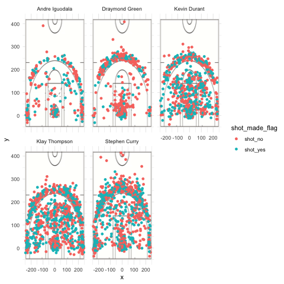

```{r setup, include=FALSE}
knitr::opts_chunk$set(echo = TRUE)
```

```{r}
library(dplyr)
```

```{r out.width = '80%', echo=FALSE, fig.align='center'}

```

#####2PT Effective Shooting % by Player: 2 PT Field Goal effective shooting percentage by player, arranged in descending order by percentage.
```{r}
name <- c("Stephen Curry", "Andre Iguodala", "Draymond Green", "Kevin Durant", "Klay Thompson")

curry_total_2p <- nrow(filter(shots_data, name=="Stephen Curry" & shot_type=="2PT Field Goal"))-1
iguodala_total_2p <- nrow(filter(shots_data, name=="Andre Iguodala" & shot_type=="2PT Field Goal"))-1
green_total_2p <- nrow(filter(shots_data, name=="Draymond Green" & shot_type=="2PT Field Goal"))-1
durant_total_2p <- nrow(filter(shots_data, name=="Kevin Durant" & shot_type=="2PT Field Goal"))-1
thompson_total_2p <- nrow(filter(shots_data, name=="Klay Thompson" & shot_type=="2PT Field Goal"))-1
total_2p <- c(curry_total_2p, iguodala_total_2p, green_total_2p, durant_total_2p, thompson_total_2p)

curry_made_2p <- nrow(filter(shots_data, name=="Stephen Curry" & shot_type=="2PT Field Goal" & shot_made_flag == "shot_yes"))-1
iguodala_made_2p <- nrow(filter(shots_data, name=="Andre Iguodala" & shot_type=="2PT Field Goal"& shot_made_flag == "shot_yes"))-1
green_made_2p <- nrow(filter(shots_data, name=="Draymond Green" & shot_type=="2PT Field Goal"& shot_made_flag == "shot_yes"))-1
durant_made_2p <- nrow(filter(shots_data, name=="Kevin Durant" & shot_type=="2PT Field Goal"& shot_made_flag == "shot_yes"))-1
thompson_made_2p <- nrow(filter(shots_data, name=="Klay Thompson" & shot_type=="2PT Field Goal"& shot_made_flag == "shot_yes"))-1
made_2p <- c(curry_made_2p, iguodala_made_2p, green_made_2p, durant_made_2p, thompson_made_2p)

eff_2p <- data.frame("name"= name, "total" = total_2p, "made" = made_2p)
arrange(mutate(eff_2p, perc_made=made_2p/total_2p), desc(perc_made))
```

#####3PT Effective Shooting % by Player: 3 PT Field Goal effective shooting percentage by player, arranged in descending order by percentage.
```{r}
curry_total_3p <- nrow(filter(shots_data, name=="Stephen Curry" & shot_type=="3PT Field Goal"))-1
iguodala_total_3p <- nrow(filter(shots_data, name=="Andre Iguodala" & shot_type=="3PT Field Goal"))-1
green_total_3p <- nrow(filter(shots_data, name=="Draymond Green" & shot_type=="3PT Field Goal"))-1
durant_total_3p <- nrow(filter(shots_data, name=="Kevin Durant" & shot_type=="3PT Field Goal"))-1
thompson_total_3p <- nrow(filter(shots_data, name=="Klay Thompson" & shot_type=="3PT Field Goal"))-1
total_3p <- c(curry_total_3p, iguodala_total_3p, green_total_3p, durant_total_3p, thompson_total_3p)

curry_made_3p <- nrow(filter(shots_data, name=="Stephen Curry" & shot_type=="3PT Field Goal" & shot_made_flag == "shot_yes"))-1
iguodala_made_3p <- nrow(filter(shots_data, name=="Andre Iguodala" & shot_type=="3PT Field Goal"& shot_made_flag == "shot_yes"))-1
green_made_3p <- nrow(filter(shots_data, name=="Draymond Green" & shot_type=="3PT Field Goal"& shot_made_flag == "shot_yes"))-1
durant_made_3p <- nrow(filter(shots_data, name=="Kevin Durant" & shot_type=="3PT Field Goal"& shot_made_flag == "shot_yes"))-1
thompson_made_3p <- nrow(filter(shots_data, name=="Klay Thompson" & shot_type=="3PT Field Goal"& shot_made_flag == "shot_yes"))-1
made_3p <- c(curry_made_3p, iguodala_made_3p, green_made_3p, durant_made_3p, thompson_made_3p)

eff_3p <- data.frame("name"= name, "total" = total_3p, "made" = made_3p)
arrange(mutate(eff_3p, perc_made=made_3p/total_3p), desc(perc_made))
```

#####Effective Shooting % by Player: Overall (i.e. including 2PT and 3PT Field Goals) effective shooting percentage by player, arranged in descending order by percentage.
```{r}
curry_total <- nrow(filter(shots_data, name=="Stephen Curry"))-1
iguodala_total <- nrow(filter(shots_data, name=="Andre Iguodala"))-1
green_total <- nrow(filter(shots_data, name=="Draymond Green"))-1
durant_total <- nrow(filter(shots_data, name=="Kevin Durant"))-1
thompson_total <- nrow(filter(shots_data, name=="Klay Thompson"))-1
total <- c(curry_total, iguodala_total, green_total, durant_total, thompson_total)

curry_made <- nrow(filter(shots_data, name=="Stephen Curry" & shot_made_flag == "shot_yes"))-1
iguodala_made <- nrow(filter(shots_data, name=="Andre Iguodala" & shot_made_flag == "shot_yes"))-1
green_made <- nrow(filter(shots_data, name=="Draymond Green" & shot_made_flag == "shot_yes"))-1
durant_made <- nrow(filter(shots_data, name=="Kevin Durant"& shot_made_flag == "shot_yes"))-1
thompson_made <- nrow(filter(shots_data, name=="Klay Thompson" & shot_made_flag == "shot_yes"))-1
made <- c(curry_made, iguodala_made, green_made, durant_made, thompson_made)

eff <- data.frame("name"= name, "total" = total, "made" = made)
arrange(mutate(eff, perc_made=made/total), desc(perc_made))
```

#Report
Here is my Report on GSW in their 2016-2017 season. They won the Champion in 2016 with dominating stats and games. Worth to mention, this is Kevin Durant's first season at GSW, and it is also his first Championship throughout his NBA Career. Also He is the FMVP of this Championship. With all the blames and hatred on Kevin Durant's decision to come join GSW, he has shown the world that he needed this Championship ring and now he gets it and he deserves it.

Excitement, Cheer, Madness roam across bay area. We have shown every other states how GSW fights and how GSW wins. After the excitement, let's settle down and dig deeper into the stats and find out why exactly is GSW so unstoppable on its offensive end. And most importantly, what has Kevin Durant bring to the table.

It is well known that GSW is the strongest shooting team in NBA right now. I will focus on five main scorer: KD, Andre, Klay, Curry, Green. Four of them is from the starting line up, and Andre Iguodala is the 6th man/sub. GSW has broken several 3 points record, lets first look at the second chart - 3PT Effective Shooting % by Player. Klay with the highest percentage 42% stands at the top of the table; Along with Klay is our Curry - 40%. Curry and Klay are the main 3 point shooters on the team, and GSW had won so many games where they are far behind on the score board, making a huge comeback by putting 3s in the bucket. Curry and Klay has made 600+ three points attempt in the season, and this is an insane ammount of threes. This shows how GSW values their offensive strategies' on shooting three points. Curry is always the leading 3 point shooter in the league, and Klay has been stable with his three point shots for a period now. What is shocking in this table is Kevin Durant. KD can defintely shoot threes, but not like this 38%! Now we can see all three superstar player, Klay, Curry, KD all has a three point average around 40%. This is an overwhelming effectiveness along the three point line. This stats is telling every opponents that you cannot slack off in your defense, because if you do, I am going to score a three point in your face. This was how much pressure GSW is forcing their opponents on the defensive side.

After talking about 3 points, lets go back to 2 points, and look at the first table - 2PT Effective Shooting % by Player. 5 player has 2 pt shooting percentage from 50-60%. Andre Iguodala, the 6th man, owns a 63% 2 pt effective shooting. He also has a 36% in 3p shooting as well. This is another important factor on why GSW is unstoppable on its offensive end. Iguodala can steadly put buckets in(scoring) while 1 or 2 starting lineup take a rest on the bench. This means GSW has no gap in its offensive rythm. Unlike other teams may have an offensive break or weakness when their starting line up is off the court, GSW rotates KD, Curry, Klay, and Andre to make sure there are always two best scorer on the court to maintain the offensive pressure on the opponents.

Lastly lets talk about Kevin Durant, our FMVP. I talked about his improvement in three points in GSW. The 2 point stats 60% also told me that he has not forgotten his strength, which is mid range and close range.If you look at the graph I provided at the top of the report, in Kevin Durant's chart, you can see green dots(shots made) all over the court. And compare to other 4 players where their green dots may follow some pattern, KD's green dots is just everywhere. And this shows he has little weakness in offense: He can score almost anywhere on this court. KD is a tall guy, with impressive verticals and impressive arm spam(long arms). With high basketball IQ, he always find the easiest way to put the ball in the bucket using his advantage. This makes him such a tough guy to defend agasint. One most usual scene any fans woukld see KD do in the game is he gets the ball, jumpshot, and score in his opponents' face. It is that simple. Under the board, he also has the ability to find space and do a powerful hook or fade away. With his height and long arms, even the best center in the league cannot say one can stop him scoring inside. All of this leads to KD's 54% total shooting percentages. And this number shows us how strong he can be at scoring and how effective he becomes when he is in the game.

What KD brings to GSW is an expension of its arsenal, which made GSW even more scary on its offense. Three table shows how good this team can shoot: Kevin Durant shooting all over the places maintaining a high effectiveness, Klay and Curry maintain a high pressure on the 3 point line, Iguodala brings in a stable scoring ability as a 6th man. And green, he is not even the scorer in this team (I will explain why), but he still brings so much effecitiveness in scoring according to the table. Green functions as a support in his team. He is so powerful and agressive on the defensive and rebounding perspectives. On offense side, he is always the man who is creating space for his teammates. So I do not even consider green as a scoring focus on GSW. The reason he is in this table is that I want to show how good a supportive player on the starting line up can be at scoring. Putting green into any other NBA team, he could be one of the best scorer, but in GSW he is the best support. This is why GSW is such a strong and unstoppable Champion, and I believe they are going to continously make new history and records in NBA.


